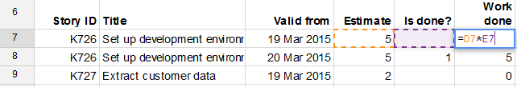

# What is this?

This is a set of functions and macros to allow easier creation of burn-up charts
with Google Sheets. For detailed info see:

- [How to use the basic capabilities](https://niksilver.com/2015/06/15/easy-burn-up-chart/);
- [More advanced functions](https://niksilver.com/2016/08/02/burn-up-charts-with-google-sheets/)..

# Tl;dr

Simply go to the original spreadsheet,
make your own copy using `File > Make a copy`, and name it as you like.
Then close the original and play around with your new burn-up spreadsheet.


# Basic use

Burn-up charts are a great way to demonstrate progress against
(possibly changing) scope. And although the data needed to create
such a chart is simple, if you also want to track the historical
changes in the data (for tracing why things changed) then it’s
surprisingly tricky.

If you’re working on a fairly big project then a specialised tool
like Jira or Mingle may well do the job for you. But if your project is
more modest then the cost, setup and maintenance of such a tool may be excessive.

This is a way of creating a burn-up chart with Google Sheets.

- [Overview](#overview)
- [Setup](#setup)
- [Tracking changes](#tracking-changes)
- [Creating the burn-up data](#creating-the-burn-up-data)
- [The burn-up chart](#the-burn-up-chart)
- [Top tip for greater reliability](#top-tip-for-greater-reliability)
- [More tips and tricks](#more-tips-and-tricks)

## Overview

The core of process is two tables. The first is your historical
data. This lists the user stories you’re tracking, as well as any
changes for each story (such as its estimated size, or whether it’s
done). The second table summarises the data. It has a list of dates,
and for each date it shows the total done and total scope. And this
table is the basis for the line chart that is our burn-up chart.

Now for the details…

## Setup

<image align="right" src="docs/make-a-copy.png">

The first thing you need is the basic
spreadsheet. You need to copy my original because it comes with a
script. So go to the original sheet, click `File > Make a copy` and
name it as you like. Then close the original.

You’ll see there are four sheets: User stories, Burn-up, Burn-up
with smarter formulas, and Tests. You only need to keep the Tests
sheet if you want to see how I’ve written automated tests against
the script. But you probably don’t, so the first thing you can
do is delete that Tests sheet.

If you would like see the code behind the sheet then you can go to
`Tools > Script editor` and you’ll see the code.

Now we’ll walk through the the two tables, what they do, and how
they work.  Basic historical data

The User stories sheet contains a table of our historical data—that
is, our user stories as they change over time.

In the first instance each user story is just listed as a separate
row in the table. Here are some columns you’ll want to include:

- The story’s title
- Its size estimate
- A Done flag (0 or blank is not done, 1 is done)
- Its “done size” (which is the estimate multiplied by the Done flag—a very simple spreadsheet formula).

The size and the “done size” are what go into the burn-up
chart. They give us our Actual and Scope lines respectively.



But for this spreadsheet, as well as those obvious fields there are three things you must include:

- A header row.
- A unique ID for each story
- A “valid from” date that says when the data in this row came into
  effect---i.e. when the data changed.

Let’s go into these in a bit more detail…

The header row is needed because we’ll want to pick out individual
columns later, and that will help us. You can call the columns
anything you like, though.

The unique ID is needed to distinguish each story. This will
become important when we want to track the same story through
several changes.

The “valid from” column says when the data in this row became
true. So if all our stories were created on 19 March 2015 then
that’s the date that will go into that cell for every story. But
if a new story gets created on 23 March 2015 then that’s the date
that goes against that story.

As mentioned above you can call the ID column and the “valid
from” column anything you like. But they must each be labelled
in the header row.

So in summary: you must include a header row, an ID for each story
and a “valid from” field. And you’ll also want to include
all the usual data for tracking progress, including story size and
total work done among others.

## Tracking changes

The historical data we’ve created so far is not very
historical. It’s just a list a list of stories, some of which
might have been added at a later date than others.

But what if a story changes? The “done” status, the size,
or something else might change.

In this case we simply add a new row with its updated data. But
when we do this we need to (i) keep the ID the same, and (ii) make
sure the “valid from” date is the date on which this new state
became true.

For example, suppose story K729 has size 5 and was created on
19 March 2015. Then that row appears in our table with ID K729
and “valid from” date 19 March 2015. But if on 25 March 2015
we re-estimate the story to be size 11 then we add a new row to
reflect this. This new row is a straight copy of the original,
but we change the size to be 11 and the date to be 25 March 2015.

We can add our new row anywhere we like, but I prefer to keep any
story change directly under its previous state. You might prefer
to put changes in date order. It doesn’t matter. And if you
change your mind later you can always re-order or sort the rows
differently. The important thing is to keep the header at the top.

## Creating the burn-up data

Data for the burn-up chart is created from this historical data. In
the original spreadsheet I’ve put it in its own sheet (Burn-up)
to keep things tidy.

The burn-up data is a table with two or more columns, depending
on what we want to chart. The first column represents the x-axis,
and is a series of dates. If our project starts on 19 March 2015
then this column lists 19 March 2015, 20 March, 21 March, and so
on to today’s date.

The second and subsequent columns are for each line we want to plot
on the burn-up chart. This is where our special script comes in.

So let’s say we want to show “scope” in the second column. We
need a function that sums all the “size estimate” cells in
the historical data, but only as the data stood on the given date
(19 March, then 20 March, etc).

This is a new function, `sumValid`, which is created by the script
behind the spreadsheet. It takes the following parameters: first, the
date we’re currently interested in; second the entire historical
data table, including its header; and finally the names in the
header row for the ID, the “valid from” date and the “size
estimate” columns respectively.

With this formula we’re saying: sum all the data that’s valid
at the specified date, where this is the historical data and we
can pick out each story, when it changed, and where this is the
data to add up.

So if `J11` contains the project start date, 19 March, and `A7:F30`
is our historical data, then for calculating the scope for the
first day of the project we might have a formula that reads:

```
=sumValid(J11, A7:F30, “Story ID”, “Valid from”, “Estimate”)
```

To get the data for the second day of the project (the cell
immediately below that) we use exactly the same formula, but this
time the first parameter points to `J12`, which is cell for 20 March.

And then you can copy the formula down the column for every date until today.

Of course if you copy or drag formulas then your cell references
will change, so make sure you use `$` signs as appropriate. And if
your historical data is on another sheet (as it is in our original
spreadsheet) then again the cell references won’t look quite like
this. In the original spreadsheet the formula is:

```
=sumValid($A11, ‘User stories’!$A$7:$F$30, “Story ID”, “Valid from”, “Estimate”)
```

Now let’s suppose for the third column of the burn-up data we want
to calculate work done as it was on each day. For this we use exactly
the same formula, but this time the last parameter is “Work done”
(or whatever we’ve called the column in the historical data).

So for the first cell in the third column our formula might read:

```
=sumValid(…, …, “Story ID”, “Valid from”, “Work done”)
```

where the cell references have been elided for clarity. Once again
we can use this same formula all the way down the column. And once
again we need to make sure we use $ signs appropriately, so the
date parameter changes line by line, but the historical data range
stays the same.

## The burn-up chart

Now the burn-up chart is easy. We just create a line chart from
the burn-up data we’ve just created.

As you add more lines to the burn-up data make sure the burn-up
chart references the latest data, including those new lines you’ve
just added.

## Top tip for greater reliability

Although I’ve used a lot of words to describe this process, I
hope that in practice you can see it’s pretty simple. But here’s
another feature of `sumValid` that makes it even easier. Take a look
at the other sheet, Burn-up with smarter formulas.

I’ve previously said that the first parameter of `sumValid` is the
date we want to calculate a value for. But we can instead supply a
date range. If we point to our entire column of dates then `sumValid`
will not only calculate the value for the first date, it will also
fill in the values for all the other dates. We must make sure those
cells are blank though—only then can it fill them in; if not it
will give a `#REF!` error.

This is a really big benefit. It means we only need to worry about
one formula for each line of the burn-up chart. When you extend
your burn-up chart, or when you extend your historical data table,
then you must update those formulas. But you’d have to do that
anyway with the previous method, and there are more formulas to
worry about there.

## More tips and tricks

Here are some other details that might be of interest…

- The more data you have the slower the `sumValid` function gets.
  But for a project lasting a few weeks it should be fine.
- If `sumValid` gives you an error then read the error message
  carefully---it should give you a bit of help. Things which
  cause errors include:
  - Referencing a column in the historical data which doesn’t exist
   (e.g. you say “ID” but the header says “Story ID”);
  - a line in the historical data has missing ID or a missing “valid from” date.
- The historical data can include blank lines. But the first row must be the header row.
- As your project develops your historical data will grow.
  So make sure the `sumValid` formulas encompass the latest historical data.


# Developing

## Setup

To set yourself up
install [clasp](https://codelabs.developers.google.com/codelabs/clasp/#0),
the Google Apps Script commandline tool. Then log in:

```
% clasp login
```

## Working with the code

Pull the code down from Google if you think you're out of sync:

```
clasp pull
```

When you want to update Google, push your code:

```
clasp push
```

Before running the tests, first make sure you're in the script editor:
from the spreadsheet go to `Tools > Script editor`.

To run the tests in the script editor, first make sure you've got `Tests 0 - All.gs` open
and click the `Play` icon (a triangle) and then click `View > Logs`.

## Useful references

- [Google Apps Script reference for Sheets](https://developers.google.com/apps-script/reference/spreadsheet/)

