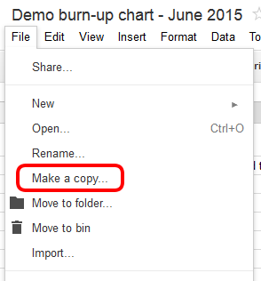
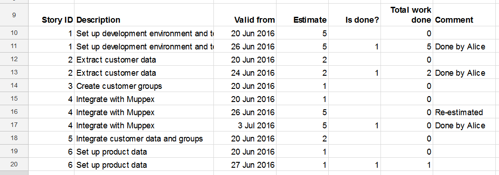
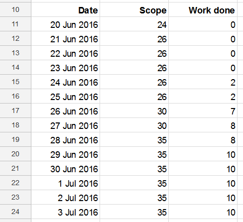
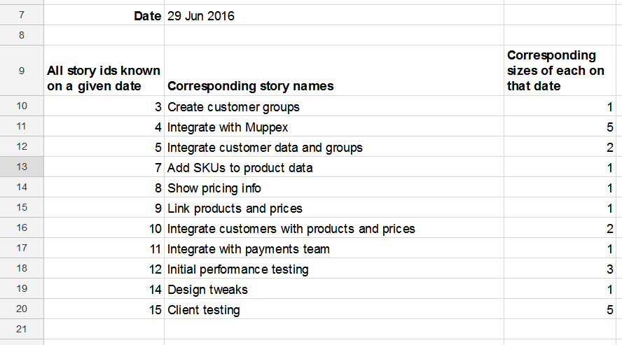

# What is this?


This is a set of functions and macros for Google Sheets
to allow easier creation of burn-up charts.
You can use a commercial tool such as Jira and TFS, but
sometimes you may want the flexibility and lightness of a spreadsheet.

# Tl;dr

Simply go to
[the original spreadsheet](https://docs.google.com/spreadsheets/d/1NiK41B1cRxZ7RFlH-ylzcG1W5LduEf-dkzd048hM_fE/edit#gid=775539403),
make your own copy using `File > Make a copy`, and name it as you like.
Then close the original and play around with your new burn-up spreadsheet.

- [Basic use](#basic-use)
  - [Create our spreadsheet](#create-our-spreadsheet)
  - [Basic principles](#basic-principles)
  - [The historical data](#the-historical-data)
  - [Using the shortcut key](#using-the-shortcut-key)
  - [Tips for working with historical data](#tips-for-working-with-historical-data)
  - [Creating the burn-up data](#creating-the-burn-up-data)
  - [The burn-up chart](#the-burn-up-chart)
  - [More tips and tricks](#more-tips-and-tricks)
- [Further functions](#further-functions)
  - [`getValid`: Get data for a given date](#getvalid-get-data-for-a-given-date)
  - [`filterValid`: Filter data for a given date](#filtervalid-filter-data-for-a-given-date)
  - [Tip: Extra fields for better filtering](#tip-extra-fields-for-better-filtering)
- [Developing](#developing)
  - [Setup](#setup)
  - [Working with the code](#working-with-the-code)
  - [Running the tests](#running-the-tests)
- [References](#references)

# Basic use

This section looks at creating and maintaining a burn-up chart. Later
we will look at additional functions which may be useful for deeper
analysis.

## Create our spreadsheet



The first thing we need is the basic spreadsheet.

  1. Open
[my original spreadsheet](https://docs.google.com/spreadsheets/d/1NiK41B1cRxZ7RFlH-ylzcG1W5LduEf-dkzd048hM_fE/edit#gid=775539403).
     This ensures we get all the functions.
  1. Make our own copy with `File > Make a copy`
  1. Rename the copy of our spreadsheet.
  1. Close the original.

We now have a spreadsheet with some sample data and charts, and
(most importantly) all the specialised functions.
We can fill this in with our own project data as we wish.

## Basic principles

The core of process is two tables.

The first is our historical data, which is a
list, or table, of all the user stories we’re tracking.
A critical feature of this table is that every time a user
story changes there is a new row for that change.
This is why we call it "historical" data.

The second table summarises the data. It has a list of dates,
and for each date it shows the total done and total scope.
From this data it's easy to generate a line chart that is our burn-up chart.

## The historical data

In the original spreadsheet the historical data is in the tab
called `User stories`. Here is a snippet:



The first most important thing to notice is the header row.
The header row is needed because it will tell our functions
which columns are which.

The next most important thing to notice is that some stories
appear repeated.
For example, there are three instances of story 4, "Integrate with Muppex".
This is essential to track changes: it shows the story was created, and then changed twice.
Every time a story changes it must appear on its own line.

We are mostly free to add whichever columns we like (whatever makes sense
to us and our project) but there are two columns which are
essential to tracking historical changes:

- A unique ID for each story
- A “valid from” date that says when the data in this row came into
  effect---i.e. when the data changed.

The unique ID ensures we can track the same story through several changes.
The "valid from" column ensures we know when any particular change took place
(i.e. when the data in that row was valid from).

Of course, because we're tracking user stories progressing through a project
there are some other columns, too:

- The story’s title
- Its size estimate
- A Done flag (0 or blank is not done, 1 is done)
- Its “done size” (which is the estimate multiplied by the Done flag—a very simple spreadsheet formula).

With all of this we have some freedom:

- We can name the columns whatever we like, even the "unique ID" and "valid from"
  columns.
- The ID doesn't need to be an integer---it can be any string we like.
  We might use something like `PBI-4635` or `2.13.8` or whatever.
- When we add a new row to represent a change in a user story we can
  add it wherever we like. It doesn't need to be under the previous
  version (although that probably makes most sense).
- We can re-order, sort and filter the data however we like,
  as long as the header row stays at the top.

## Using the shortcut key

Because copying and tweaking a line is such a common action
there's a keyboard shortcut for it: `Shift + Ctrl + Alt + 1`
on PCs, or `Shift + Option + Cmd + 1` on Macs.
This will insert a copy of the current row just below it,
and it will remove all the dates to make sure we put the right
ones in.

We can also find this function in the menus:
`Tools > Macros > Duplicate row without dates`.

## Tips for working with historical data

- The historical data can include blank lines. But the first row must be the header row.
- If we drop a user story from our project then we need to keep the historical
  data and record this change. The simplest way to do this is probably to just set the
  estimate of effort to zero.
- We might want to record an epic then later break it down into smaller user stories.
  The simplest way to do this is first record the epic as, say, 100 points of effort,
  then later record a change to it becoming zero effort while also adding new user stories.
  We can also exploit the fact that unique IDs can be any string we like, so an
  epic with ID 23 might decompose into user stories with IDs 23.1, 23.2, etc.

## Creating the burn-up data

Data for the burn-up chart is created from this historical data.
In the original spreadsheet this appears in its own sheet, `Burn-up`,
to keep things tidy.

The burn-up data is a table with two or more columns, depending
on what we want to chart.



The first column represents the x-axis, and is a series of dates.
We enter these dates ourselves.
The remaining columns are for each line we want to plot
on the burn-up chart. They are all calculations.

So let’s say we want to show "scope" in the second column. We
need a function that sums all the "size estimate" cells in
the historical data, but only as the data stood on each given date.

This is a new function, `sumValid`.
It takes the following parameters:

- the dates we’re currently interested in;
- the entire historical data table, including the header row;
- the names in the header row for
  - the ID,
  - the “valid from” date and
  - the “size estimate”.

With this formula we’re saying: sum all the data that’s valid
at the specified dates, where this is the historical data and we
can pick out each story, when it changed, and where this is the
data to add up. In the original spreadsheet it looks like this:

```
=sumValid($A11:$A24, 'User stories'!$A9:$G32, "Story ID", "Valid from", "Estimate")
```

We enter this formula into just the first cell at the top of the column.
`sumValid` will go down and fill in the values for all the dates.
We must make sure those
cells are blank though---only then can it fill them in; if not it
will give a `#REF!` error.

We can track the work done in the third column.
For this our formula is almost identical, but now we want to
sum the "Work done" data, instead. So it looks like this.
Just the last parameter has changed:

```
=sumValid($A11:$A24, 'User stories'!$A9:$G32, "Story ID", "Valid from", "Total work done")
```

Notice the use of `$` signs in the formulas to allow us to copy the formula easily.

## The burn-up chart

Now the burn-up chart is easy. We simply create a line chart from
the burn-up data we’ve just created.


## More tips and tricks

Here are some other details that might be of interest...

- The more data we have the slower the `sumValid` function gets.
  But for a project lasting a few weeks it should be fine.
- If `sumValid` gives us an error then read the error message
  carefully---it should give us a bit of help. Things which
  cause errors include:
  - Referencing a column in the historical data which doesn’t exist
   (e.g. we say “ID” but the header says “Story ID”);
  - a line in the historical data has missing ID or a missing “valid from” date.
- As our project develops our historical data will grow.
  So make sure the `sumValid` formulas encompass the latest historical data.


# Further functions

As well as `sumValid` there are some functions
intended to help us get a better view of the work in progress at any moment in time.

## `getValid`: Get data for a given date

This function gets us a view of our work as it
was on any particular date.

The function `getValid` effectively says "For a given date get
all the values of a given field". The parameters are:

- The date in question;
- Three parameters specifying the historial data:
  - the range of the data (including the header row),
  - the column name of the story ID,
  - the column name of the date from which this row’s data is valid;
- The column name of the field we want to show.

Here’s an example from the original spreadsheet.
We can find it in the tab named `Listing example`.

Let’s suppose we want to
see the stories that were known on 21 June 2016. In particular
we decide we want to list three fields: the story id, its name,
and its estimate. That means we want to use a `getValid` forumula
three times: once for the id, once for the name, and once for the
estimate.

The resulting table will look like this:


Notice that
story id 15 is missing, and if we look at the original spreadsheet
we’ll see that’s because that story was introduced only at a
later date.

To create this,
there is one formula for each column. Here is the first one:

```
=getValid($B6, 'User stories'!$A9:$G32, "Story ID", "Valid from", "Story ID")
```

We only need to enter this on the first row of the first column; the
the rest of the column will auto-fill with the results.

The next two columns contain formulas that are identical except for the last parameter:

```
=getValid($B6, 'User stories'!$A9:$G32, "Story ID", "Valid from", "Description")
```

and

```
=getValid($B6, 'User stories'!$A9:$G32, "Story ID", "Valid from", "Estimate")
```

When creating this table we need to be sure that all three formulas
use the same date and the same data. Otherwise the data in the
rows will not line up.

## `filterValid`: Filter data for a given date

While we can put a spreadsheet
filter on the `getValid` results above, we can also use a dedicated
formula: `filterValid`. This effectively says "For a given date get
all the values of a given field
where a certain condition is met".

The parameters for `filterValid` are just the same as for `getValid`, but
there are two extra ones at the end:

- The date in question;
- Three parameters specifying the historial data:
  - the range of the data (including the header row),
  - the column name of the story ID,
  - the column name of the "valid from" field;
- The column name of the field we want to show;
- The column name of the field we want to test;
- The value that this field must be in order to pass the test.

For example, if we want to show only those stories that weren’t
done on a given date then we might test the Is done? field for
value 0. We can see the results in the original spreadsheet in the tab named
`Filtering example`:



Once again there is one formula at the top of each column; the
function will fill in all the results below. The formula for the
first column, showing the ID, is this:

```
=filterValid($B7, 'User stories'!$A9:$G32, "Story ID", "Valid from", "Story ID", "Is done?", 0)
```

For the second column, with the showing the description of the story, it's
the same except for one field:

```
=filterValid($B7, 'User stories'!$A9:$G32, "Story ID", "Valid from", "Description", "Is done?", 0)
```

and to show the size estimate it's this at the top of the last column:

```
=filterValid($B7, 'User stories'!$A9:$G32, "Story ID", "Valid from", "Estimate", "Is done?", 0)
```

Once again, when creating this table we need to be sure that all three formulas
use the same date and the same data to make sure the data in the rows
all line up.

## Tip: Extra fields for better filtering

Suppose we want to find “all stories that are in milestone 2 and
not yet done”. If we’ve got a Milestone column and (of course)
a Done? column then we can achieve this by adding a new column in
our raw data with a calculation that simply says "milestone =
2 and done = true". Then we can use `filterValid` to test the
condition that this new column has the value True.

# Developing

In case you fancy developing this further yourself...

## Setup

To set yourself up
install [clasp](https://codelabs.developers.google.com/codelabs/clasp/#0),
the Google Apps Script commandline tool. Then log in:

```
clasp login
```

Edit `.clasp.json` to make sure it's pointing to the right Google Apps Script script
(i.e. yours, not mine)..
Get the correct script ID by going to the script editor, then `File > Project properties`.

## Working with the code

Pull the code down from Google if you think you're out of sync:

```
clasp pull
```

When you want to update Google, push your code:

```
clasp push
```

## Running the tests

Before running the tests, first make sure you're in the script editor:
from the spreadsheet go to `Tools > Script editor`.

Then make sure you've got `Tests 0 - All.gs` open
and click the `Play` icon (a triangle). This will run the tests.
To view the results click `View > Logs`.

# References

- [Google Apps Script reference for Sheets](https://developers.google.com/apps-script/reference/spreadsheet/)
- [The GasT test framework used as the basis for the one here](https://github.com/zixia/gast/)
- [Original article on the basic capabilities](https://niksilver.com/2015/06/15/easy-burn-up-chart/);
- [Original article on more advanced functions](https://niksilver.com/2016/08/02/burn-up-charts-with-google-sheets/).

