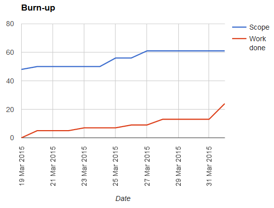
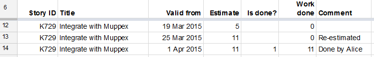
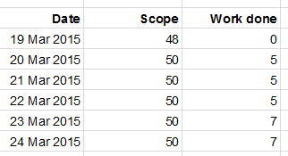
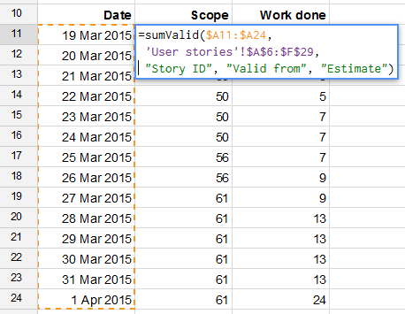
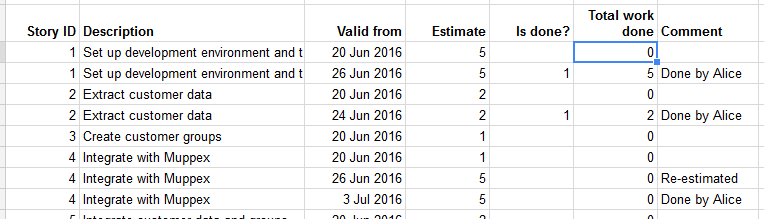
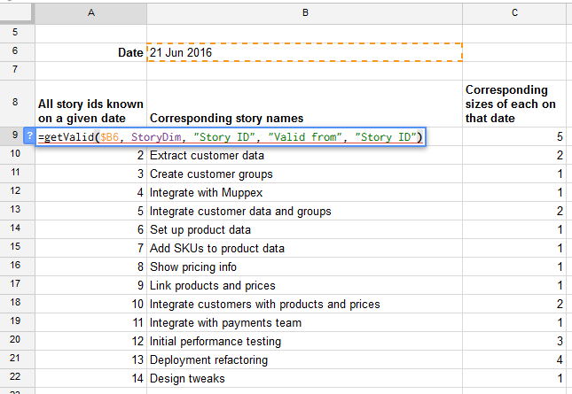
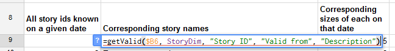
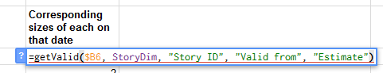
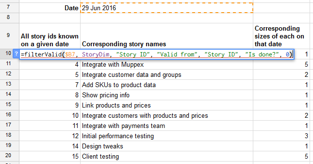

# What is this?

This is a set of functions and macros to allow easier creation of burn-up charts
with Google Sheets.



# Tl;dr

Simply go to
[the original spreadsheet](https://docs.google.com/spreadsheets/d/1NiK41B1cRxZ7RFlH-ylzcG1W5LduEf-dkzd048hM_fE/edit#gid=775539403),
make your own copy using `File > Make a copy`, and name it as you like.
Then close the original and play around with your new burn-up spreadsheet.

- [Basic use](#basic-use)
  - [Overview](#overview)
  - [Setup](#setup)
  - [Tracking changes](#tracking-changes)
  - [Using the shortcut key](#using-the-shortcut-key)
  - [Creating the burn-up data](#creating-the-burn-up-data)
  - [The burn-up chart](#the-burn-up-chart)
  - [More tips and tricks](#more-tips-and-tricks)
- [Further functions](#further-functions)
  - [Get all values for a given date](#get-all-values-for-a-given-date)
  - [Filter values for a given date](#filter-values-for-a-given-date)
  - [Tip: Extra fields for better filtering](#tip-extra-fields-for-better-filtering)
- [Developing](#developing)
  - [Working with the code](#working-with-the-code)
  - [Running the tests](#running-the-tests)
- [References](#references)

# Basic use

Burn-up charts are a great way to demonstrate progress against
(possibly changing) scope. And although the data needed to create
such a chart is simple, if you also want to track the historical
changes in the data (for tracing why things changed) then it’s
surprisingly tricky.

If you’re working on a fairly big project then a specialised tool
like Jira or TFS may well do the job for you. But if your project is
more modest then the cost, setup and maintenance of such a tool may be excessive.

This is a way of creating a burn-up chart with Google Sheets.

## Overview

The core of process is two tables. The first is your historical
data. This lists the user stories you’re tracking, as well as any
changes for each story (such as its estimated size, or whether it’s
done). The second table summarises the data. It has a list of dates,
and for each date it shows the total done and total scope. And this
table is the basis for the line chart that is our burn-up chart.

Now for the details…

## Setup

<image align="right" src="docs/make-a-copy.png">

The first thing you need is the basic
spreadsheet. You need to copy
[my original spreadsheet](https://docs.google.com/spreadsheets/d/1NiK41B1cRxZ7RFlH-ylzcG1W5LduEf-dkzd048hM_fE/edit#gid=775539403)
because it comes with a
script. So go to the original sheet, click `File > Make a copy` and
name it as you like. Then close the original.

You’ll see there several sheets including
README, User stories and Burn-up. 

If you would like see the code behind the sheet then you can go to
`Tools > Script editor` and you’ll see the code.

Now we’ll walk through the the two tables, what they do, and how
they work.  Basic historical data

The User stories sheet contains a table of our historical data—that
is, our user stories as they change over time.

In the first instance each user story is just listed as a separate
row in the table. Here are some columns you’ll want to include:

- The story’s title
- Its size estimate
- A Done flag (0 or blank is not done, 1 is done)
- Its “done size” (which is the estimate multiplied by the Done flag—a very simple spreadsheet formula).

The size and the “done size” are what go into the burn-up
chart. They give us our Actual and Scope lines respectively.


But for this spreadsheet, as well as those obvious fields there are three things you must include:

- A header row.
- A unique ID for each story
- A “valid from” date that says when the data in this row came into
  effect---i.e. when the data changed.

Let’s go into these in a bit more detail…

The header row is needed because we’ll want to pick out individual
columns later, and that will help us. You can call the columns
anything you like, though.

The unique ID is needed to distinguish each story. This will
become important when we want to track the same story through
several changes.

The “valid from” column says when the data in this row became
true. So if all our stories were created on 19 March 2015 then
that’s the date that will go into that cell for every story. But
if a new story gets created on 23 March 2015 then that’s the date
that goes against that story.

As mentioned above you can call the ID column and the “valid
from” column anything you like. But they must each be labelled
in the header row.

So in summary: you must include a header row, an ID for each story
and a “valid from” field. And you’ll also want to include
all the usual data for tracking progress, including story size and
total work done among others.

## Tracking changes

The historical data we’ve created so far is not very
historical. It’s just a list a list of stories, some of which
might have been added at a later date than others.

But what if a story changes? The “done” status, the size,
or something else might change.

In this case we simply add a new row with its updated data. But
when we do this we need to (i) keep the ID the same, and (ii) make
sure the “valid from” date is the date on which this new state
became true.

For example, suppose story K729 has size 5 and was created on
19 March 2015. Then that row appears in our table with ID K729
and “valid from” date 19 March 2015. But if on 25 March 2015
we re-estimate the story to be size 11 then we add a new row to
reflect this. This new row is a straight copy of the original,
but we change the size to be 11 and the date to be 25 March 2015.



We can add our new row anywhere we like, but I prefer to keep any
story change directly under its previous state. You might prefer
to put changes in date order. It doesn’t matter. And if you
change your mind later you can always re-order or sort the rows
differently. The important thing is to keep the header at the top.

## Using the shortcut key

Because copying and tweaking a line is such a common action
there's a keyboard shortcut for it: `Shift + Ctrl + Alt + 1`
on PCs, or `Shift + Option + Cmd + 1` on Macs.
This will insert a copy of the current row just below it,
and it will remove all the dates to make sure you put the right
ones in.

You can also find this function in the menus:
`Tools > Macros > Duplicate row without dates`.

## Creating the burn-up data



Data for the burn-up chart is created from this historical data. In
the original spreadsheet I’ve put it in its own sheet (Burn-up)
to keep things tidy.

The burn-up data is a table with two or more columns, depending
on what we want to chart. The first column represents the x-axis,
and is a series of dates. If our project starts on 19 March 2015
then this column lists 19 March 2015, 20 March, 21 March, and so
on to today’s date.

The second and subsequent columns are for each line we want to plot
on the burn-up chart. This is where our special script comes in.

So let’s say we want to show “scope” in the second column. We
need a function that sums all the “size estimate” cells in
the historical data, but only as the data stood on the given date
(19 March, then 20 March, etc).

This is a new function, `sumValid`, which is created by the script
behind the spreadsheet. It takes the following parameters:

- the dates we’re currently interested in (as a column);
- the entire historical data table, including its header; and finally
- the names in the header row for the ID, the “valid from” date and the
  “size estimate” columns respectively.

With this formula we’re saying: sum all the data that’s valid
at the specified dates, where this is the historical data and we
can pick out each story, when it changed, and where this is the
data to add up.



`sumValid` will go down and
fill in the values for all the dates. We must make sure those
cells are blank though---only then can it fill them in; if not it
will give a `#REF!` error.


So if `A11:A24` contains the dates we want to chart in our
Burn-up sheet, and `A6:F29`
is our historical data in the User stories sheet,
then for calculating the scope for all those dates
we might have a formula that reads:

```
=sumValid(A11:A24, 'User stories'!A6:F29, “Story ID”, “Valid from”, “Estimate”)
```

Now let’s suppose for the third column of the burn-up data we want
to calculate work done as it was on each day.
This is will the burning-up line on our chart.
For this we use exactly
the same formula, but this time the last parameter is “Work done”
(or whatever we’ve called the column in the historical data).

So for the first cell in the third column our formula might read:

```
=sumValid(A11:A24, 'User stories'!A6:F29, “Story ID”, “Valid from”, “Work done”)
```

Once again the `sumValid` formula will fill in the values all the way down.

Don't forget to uses `$` signs approprately if you're copying forumulas.

## The burn-up chart

Now the burn-up chart is easy. We just create a line chart from
the burn-up data we’ve just created.

As you add more lines to the burn-up data make sure the burn-up
chart references the latest data, including those new lines you’ve
just added.


## More tips and tricks

Here are some other details that might be of interest...

- The more data you have the slower the `sumValid` function gets.
  But for a project lasting a few weeks it should be fine.
- If `sumValid` gives you an error then read the error message
  carefully---it should give you a bit of help. Things which
  cause errors include:
  - Referencing a column in the historical data which doesn’t exist
   (e.g. you say “ID” but the header says “Story ID”);
  - a line in the historical data has missing ID or a missing “valid from” date.
- The historical data can include blank lines. But the first row must be the header row.
- As your project develops your historical data will grow.
  So make sure the `sumValid` formulas encompass the latest historical data.


# Further functions

As well as `sumValid` there are some functions
intended to help you get a better view of the work in progress at any moment in time.

## Get all values for a given date

This is useful if we want to get an easy view of our work as it
was on any particular date. This can be a bit tricky normally,
because the raw data lists every version of every user story,
and different stories will change on different dates.

The function `getValid` effectively says "For a given date get
all the values of a given field". The parameters are:

- The date in question;
- Three parameters specifying the raw data:
  - the range of the data (including the header row),
  - the column name of the story ID,
  - the column name of the date from which this row’s data is valid;
- The column name of the field we want to show.

Here’s an example from the demo spreadsheet. You can find it in the tab named Listing example.

Our raw data looks like this:



Let’s suppose we want to
see the stories that were known on 29 June 2016. In particular
we decide we want to list three fields: the story id, its name,
and its estimate. That means we want to use a `getValid` forumula
three times: once for the id, once for the name, and once for the
estimate. Here’s what the first formula looks like:



The formula itself uses the parameters we gave above: the date in
question, the details of the raw data (which happen to be in a named
range: `StoryDim`), and the name of the column we’re interested
in---in this case Story ID. That cell, and all the cells below it,
then fill up with all the story ids known on that date. Notice that
story id 15 is missing, and if you look at the original spreadsheet
you’ll see that’s because that story was introduced only at a
later date.

The next two columns contain formulas that are identical except for the last parameter:



and



Because all the formulas use the same data and the same date their
outputs line up. So we can be sure (for example) that story id 4
("Integrate with Muppex") was estimated as size 1 on the date
in question. But if you change the date to 26 June or later then
you’ll see its estimate changes.

## Filter values for a given date

Just getting the data is often good enough. But sometimes we want
a filtered view. For example you might want to see all stories that
weren’t yet done on a given date. While you can put a spreadsheet
filter on the `getValid` results you can also use a dedicated
formula: `filterValid`. This effectively says "For a given date get
all the values of a given field, but filtered down to just those
where a certain condition is met".

The parameters for `filterValid` are just the same as before, but
there are two extra ones at the end:

- The date in question;
- Three parameters specifying the raw data:
  - the area of the data (including the header row),
  - the column name of the story ID,
  - the column name of the date from which this row’s data is valid;
- The column name of the field we want to show;
- The column name of the field we want to test;
- The value that this field must be in order to pass the test.

For example, if we want to show only those stories that weren’t
done on a given date then we might test the Is done? field for
value 0. We can see this in the demo spreadsheet in the tab named
Filtering example:



The two cells next to it again have exactly the same formula,
except the fifth parameter is replaced each time to show a different
field (again: the name and the estimate). Obviously you can show
any field(s) you like. In the screenshot above you can see some
stories are missing: they are the ones that have been done.

## Tip: Extra fields for better filtering

Suppose we want to find “all stories that are in milestone 2 and
not yet done”. If we’ve got a Milestone column and (of course)
a Done? column then we can achieve this by adding a new column in
our raw data with a calculation that simply says "milestone =
2 and done = true". Then we can use `filterValid` to test the
condition that this new column has the value True.

# Developing

In case you fancy developing this further yourself...

## Setup

To set yourself up
install [clasp](https://codelabs.developers.google.com/codelabs/clasp/#0),
the Google Apps Script commandline tool. Then log in:

```
clasp login
```

Edit `.clasp.json` to make sure it's pointing to the right Google Apps Script script
(i.e. yours, not mine)..
Get the correct script ID by going to the script editor, then `File > Project properties`.

## Working with the code

Pull the code down from Google if you think you're out of sync:

```
clasp pull
```

When you want to update Google, push your code:

```
clasp push
```

## Running the tests

Before running the tests, first make sure you're in the script editor:
from the spreadsheet go to `Tools > Script editor`.

Then make sure you've got `Tests 0 - All.gs` open
and click the `Play` icon (a triangle). This will run the tests.
To view the results click `View > Logs`.

# References

- [Google Apps Script reference for Sheets](https://developers.google.com/apps-script/reference/spreadsheet/)
- [The GasT test framework used as the basis for the one here](https://github.com/zixia/gast/)
- [Original article on the basic capabilities](https://niksilver.com/2015/06/15/easy-burn-up-chart/);
- [Original article on more advanced functions](https://niksilver.com/2016/08/02/burn-up-charts-with-google-sheets/).

